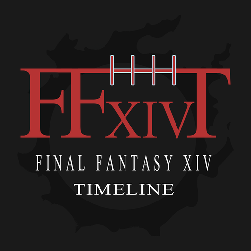
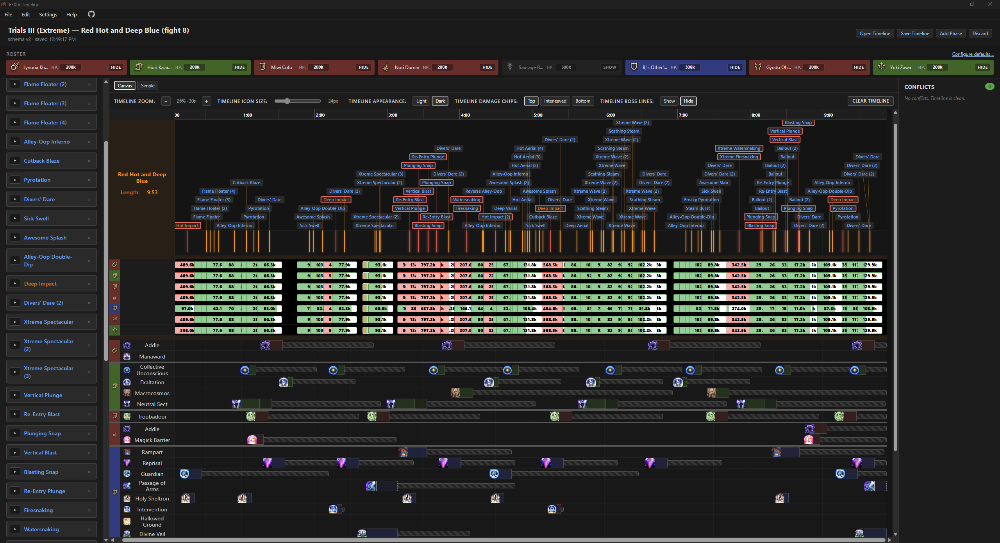

<p align="center">
  
</p>
<p align="center">
      
</p>

# FFXIV Raid Timeline and Mitigation Planner
#### **NOTE:** Planned updates before and during the Dancing Mad (Ultimate) are tracked on the [Issues page.](https://github.com/rmoskwa/ffxiv-timeline-app/issues) Please feel free to offer suggestions (and complain about bugs!)


Local desktop app for building and planning FFXIV raid timelines with drag-and-drop mitigation and boss ability placement. Import timelines to plan a mit sheet for your static, or create your own and share.

## Real-time visual mitigation feedback in the Canvas view
https://github.com/user-attachments/assets/23342d4b-01ef-4fb3-b55d-c921e5f8c343

## Mitigation planning at-a-glance in the Simple view
https://github.com/user-attachments/assets/ac606ed7-3e54-43a5-865b-288fb761cba1

## Get as detailed as you want!


## Curious what mitigations are available in FFXIV-Timeline?
See the mitigation documentation 
## Quickstart

1. Download the latest installer from the [Releases page](https://github.com/rmoskwa/ffxiv-timeline-app/releases/latest)
2. Run the installer
3. Launch from the Start menu. The app checks for updates on launch and prompts you when a new version is available.

**Requirements:**

- **Windows 10 or 11** — If installed offline on Windows 10, you may need to install WebView2. You can find it here: <https://developer.microsoft.com/microsoft-edge/webview2/>.
- **Linux** — Built against Ubuntu 22.04, so glibc ≥ 2.35 is required. The webview runs on WebKitGTK, which must be present on the host:
  - **Debian / Ubuntu** — install the `.deb`; `apt` pulls `libwebkit2gtk-4.1-0` automatically.
  - **Fedora / RHEL** — install the `.rpm`; `dnf` pulls `webkit2gtk4.1` automatically.
  - **AppImage (any distro)** — the AppImage does *not* bundle WebKitGTK, so install it first.

 For example, on Fedora:
  ```
  sudo dnf install webkit2gtk4.1 gtk3 libsoup3
  ```
  A white screen with `Could not create default EGL display: EGL_BAD_PARAMETER` means these runtime libraries are missing.

## For Developers

Built with React 19 + TypeScript (Vite) on a Tauri 2 (Rust) desktop shell. State is Zustand; persistence is JSON files via the Tauri FS plugin.

### Setup

1. Install Rust via [rustup](https://rustup.rs)
2. Install Microsoft C++ Build Tools — Visual Studio 2022 or newer with "Desktop development with C++", or the standalone Build Tools.
3. Install Node 20+ (currently dev'd against Node 24).
4. Then:
   ```
   npm install
   npm run tauri:dev
   ```
   First build takes several minutes — Cargo compiles all Rust deps. Subsequent runs are fast.

### Scripts

| Command | What it does |
|---|---|
| `npm run dev` | Vite-only (browser at http://localhost:1420). No Tauri shell, no filesystem access. |
| `npm run tauri:dev` | Full app: launches the Tauri window, hot-reloads frontend. |
| `npm run typecheck` | `tsc --noEmit` over `src/`. |
| `npm test` | Vitest run. |
| `npm run check` | Biome lint + format with auto-fix. |
| `npm run build` | Production frontend build. |
| `npm run tauri:build` | Production desktop binary. |

## Repo structure

```
src/
├── domain/         Pure TS types + math/coverage/conflicts logic
├── data/
│   └── mit-library/  Curated bundled mit data (all 21 jobs)
├── persistence/    JSON serialize/deserialize + schema version
├── state/          Zustand store
└── ui/             React components

src-tauri/          Rust crate for the desktop shell
CONTEXT.md          Project glossary — canonical vocabulary
```
## FFXIV-Timeline Logo 
Graphics by `Araiyme`
